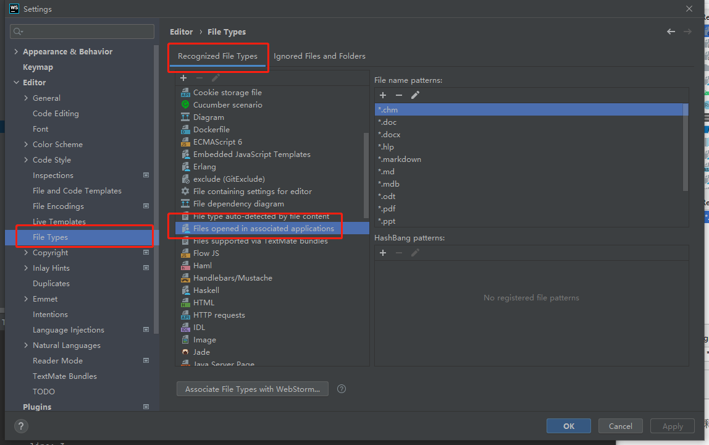
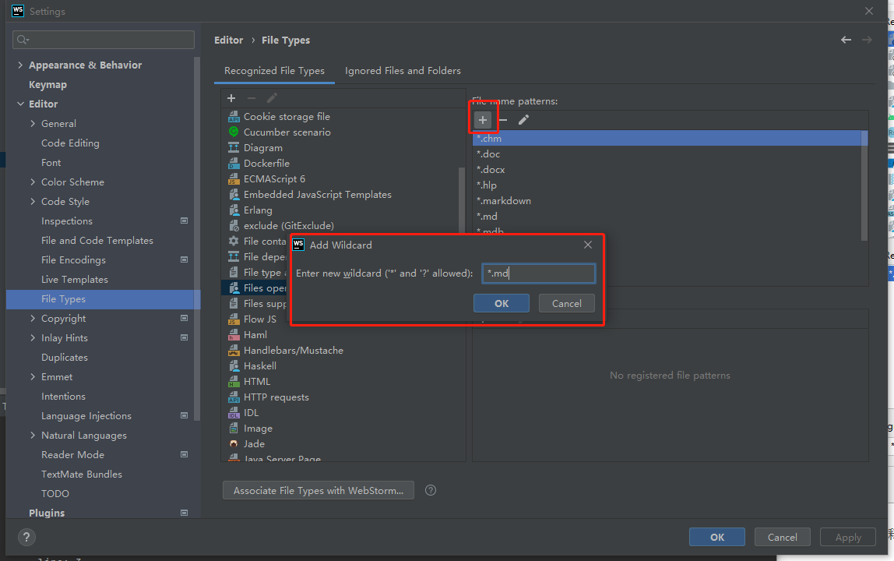

> 使用`jetbrains`全家桶时，经常会遇到某些文件想用本地软件打开。如：markdown想用typora、`mdj`想用`StarUML`打开。
>
> 一般方法：
>
> * 笨办法，打开文件所在目录，用系统软件打开
> * 通过配置`External Tool`打开
>
> 但这两种往往操作复杂，本文用markdown文件具体举例，双击就可用typora打开。

## 思路

其实markdown文件双击后，用IDEA直接打开，是因为IDEA默认识别了/关联了文件类型。所以在IDEA中双击某文件时，若已关联就会直接打开。

## 解决办法

直接设置相关类型，用系统关联的应用打开，具体步骤如下：

1. 找到`Files opened in associated applications`，具体如图：

   

2. 点击右边的`+`添加自己想用第三方软件打开的文件类型即可，如图：

   

> 此时，双击markdown文件就可直接用三方软件打开了

